# Contributing

We love contributions from everyone.
By participating in this project,
you agree to abide by the thoughtbot [code of conduct].

  [code of conduct]: https://thoughtbot.com/open-source-code-of-conduct

# Issue

See [ISSUE_TEMPLATE](ISSUE_TEMPLATE).

# Pull request

See [PULL_REQUEST_TEMPLATE.md](PULL_REQUEST_TEMPLATE.md).

# Code quality

+ Be sure to use 2 spaces instead of tabulations.

# Labels

Category      | Label(s)  | Color(s)
---           | ---       | ---
Platform      | 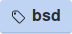 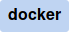 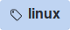 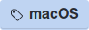 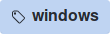 | #BFD4F2
Problems      |    | #EE3F46
Severity      |  | #B60205
Type          | 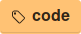 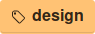 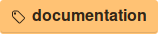 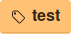  | #FFC274
Feedback      |   | #CC317C
Improvements  | 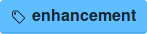 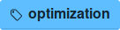  | #5EBEFF
Help          |   | #76C3A9
Additions     | 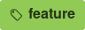  | #90C954
Pending       |     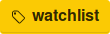 | #FBCA04
Inactive      | 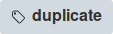 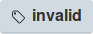    | #D2DAE1

**Note (if there is a need to add labels)**: in order to take a sharp screenshot of labels with Firefox: Right click the label => Inspect element => Right click the element on the inspector => Screenshot Node
